```{r setup, include=FALSE}
# if (!grepl("xanthahumol", getwd()) & !grepl("Users", getwd())) {
#   setwd("Rstudio_scratch/xanthahumol")
# } 
saveDir <- "Saved_objects"
inDir <- "Input"
plotDir <- "Plots"
maxCores <- 120
checkDirs <- lapply(c(saveDir, inDir, plotDir), function(dir) {
  if (!dir.exists(dir)) {
    dir.create(dir)
  }
})


knitr::opts_chunk$set(
  echo = FALSE, 
  message = FALSE, 
  warning = FALSE, 
  dpi = 150, 
  cache = FALSE
)
source("packages_sources.R")
source("Helper_scripts/map_kos.R")
source("Helper_scripts/random_forest_and_importance_functions.R")
theme_set(theme_cowplot())
my_theme <- theme_update(
  legend.position = "top",
  legend.box = "vertical",
  legend.box.just = "left",
  legend.title = element_text(size = 10),
  legend.text = element_text(size = 9),
  strip.text = element_text(size = 10),
  plot.caption = element_text(hjust = 0, size = 10),
  axis.text = element_text(size = 8)
)
nCores <- ifelse(!str_detect(getwd(), "/Users"), maxCores, 3)
img.dpi <- 150
img.ht <- 8
img.wd <- 8

assign.redo(
  c(
    "make.igc.phyloseq", 
    "make.kos.phyloseq", 
    "kraken.analyses",
    "microbiome.prep",
    "diet.ords.data",
    "diet.random.forest",
    "diet.by.covars",
    "diet.by.ceramide",
    "covar.random.forest",
    "ceramide.random.forest"
  ), 
  state = FALSE
)
set.redo.true(c("ceramide.random.forest"))
annotation.sets <- c("KOs", "IGCs") %>% set_names(., .)

sample.df <- read.csv(
  file.path(inDir, "SpatialLearning_metadata.csv"), 
  header = T, 
  row.names = 1
)
sample.df <- sample.df[complete.cases(sample.df), ]
sample.df$Diet <- factor(
  sample.df$Diet, 
  levels = c("Control", "XN", "DXN", "TXN")
  )
sample.dt <- as.data.table(sample.df, keep.rownames = "Sample") %>% setkeyv("Sample")
spat.learn.vars <- names(sample.df)[-1]

igc.phyloseq.file <- file.path(saveDir, "phyloseq_with_igc_contig_counts.rds")
ps.igc <- redo.if("make.igc.phyloseq", igc.phyloseq.file, {
  igc.contig.mat0 <- read.table(
    file.path(inDir, "XN_count_table.txt"), 
    header = T, 
    sep = "\t", 
    row.names = 1
  ) %>% as.matrix()
  gene.lens0 <- igc.contig.mat0[, 1]
  igc.contig.mat1 <- igc.contig.mat0[, -1]
  row.sums <- rowSums(igc.contig.mat1)
  col.sums <- colSums(igc.contig.mat1)
  keep.rows <- row.sums[row.sums > 0] %>% names()
  igc.contig.mat2 <- igc.contig.mat1[keep.rows, ]
  gene.lens1 <- gene.lens0[keep.rows]
  igc.contig.mat3 <- igc.contig.mat2 / gene.lens1
  col.names <- colnames(igc.contig.mat3)
  for (name in col.names) {
    igc.contig.mat3[, name] <- igc.contig.mat3[, name] / col.sums[name]
  }
  colnames(igc.contig.mat3) <- gsub("sample_", "s", colnames(igc.contig.mat3))
  igc.contig.mat4 <- t(igc.contig.mat3)
  igc.contig.mat <- igc.contig.mat4[row.names(sample.df), ]
  phyloseq(
    sample_data(sample.df),
    otu_table(igc.contig.mat, taxa_are_rows = FALSE)
  )
})

kos.phyloseq.file <- file.path(
  saveDir, 
  "phyloseq_with_ko-collapsed_contig_counts.rds"
)
ps.kos <- redo.if("make.kos.phyloseq", kos.phyloseq.file, {
  igc.mat0 <- otu.matrix(ps.igc)
  map.tbl0 <- read.table(
    file.path(inDir, "XN_gene_to_ko_mapping.tsv"), 
    header = F, 
    sep = "\t"
  ) %>% as.data.table()
  names(map.tbl0) <- c("Contig", "GeneID", "KO", "Length")
  
  map.tbl1 <- map.tbl0[KO != ""]
  multi.kos <- str_subset(map.tbl1$KO, ",")
  
  cl <- makeCluster(nCores, type = "FORK", outfile = "")
  registerDoParallel(cl, nCores)
  new.rows.dt <- foreach(
    multi.ko = multi.kos,
    .final = rbindlist,
    .verbose = TRUE
  ) %dopar% {
    kos <- str_split(multi.ko, ",")[[1]]
    rows <- map.tbl1[KO == multi.ko]
    kos.dt <- lapply(kos, function(ko) {
      rows$KO <- ko
      return(rows)
    }) %>% rbindlist()
    return(kos.dt)
  }
  stopCluster(cl)
  
  map.tbl2 <- rbind(map.tbl1[!str_detect(KO, ",")], new.rows.dt)
  nrow(map.tbl1)
  nrow(map.tbl2)
  
  keep.contigs <- unique(map.tbl2$Contig)
  keep.contigs <- keep.contigs[keep.contigs %in% colnames(igc.mat0)]
  
  map.tbl <- map.tbl2[Contig %in% keep.contigs]
  igc.mat <- igc.mat0[, keep.contigs]
  
  uniq.kos <- unique(map.tbl$KO)
  kos.mat <- NULL
  for (ko in uniq.kos) {
    cat(ko, sep = "\n")
    ko.contigs <- map.tbl[KO == ko]$Contig
    ko.igcs <- igc.mat[, ko.contigs, drop = F]
    ko.col <- rowSums(ko.igcs, na.rm = TRUE)
    kos.mat <- cbind(kos.mat, ko.col)
    colnames(kos.mat)[ncol(kos.mat)] <- ko
  }
  
  phyloseq(
    sample_data(sample.df),
    otu_table(kos.mat, taxa_are_rows = FALSE)
  )
})

ps.list <- list(
  IGCs = ps.igc,
  KOs  = ps.kos
)
map.tbl <- map.kos(ps.list$KOs)
names(map.tbl) <- c("Feature", "Name", "Mod", "Mod.name")
setkey(map.tbl, Feature)

igc.kos.map <- read.table(
  file.path(inDir, "XN_gene_to_ko_mapping.tsv"), header = F, sep = "\t"
) %>% as.data.table()
names(igc.kos.map) <- c("IGC", "GeneID", "KO", "Length")
setkey(igc.kos.map, IGC)

igc.eggnog.map0 <- readRDS(
  file.path(inDir, "EggNOG_xanthohumol_annotations.rds")
) %>% as.data.table()
keep.cols <- c("query_name", "Preferred_name")
igc.eggnog.map <- igc.eggnog.map0[, ..keep.cols]
names(igc.eggnog.map)[1] <- "IGC"
setkey(igc.eggnog.map, IGC)

igc.kraken.map0 <- read.table(
  file.path(inDir, "kraken2_all_counts.txt"), 
  sep = "\t", 
  header = T,
  row.names = 1
) %>% as.matrix()
taxa.lvl.mat <- igc.kraken.map0[
  str_detect(rownames(igc.kraken.map0), "s__") & 
    !str_detect(rownames(igc.kraken.map0), "Eukaryota|Viruses"),
] %>% t()
taxa.lvl.labs <- colnames(taxa.lvl.mat)
# taxa.lvl.labs[3720]
taxa.lvl.dt <- data.table(
  Level = c("Domain", "Phylum", "Class", "Order", "Family", "Genus", "Species"), 
  ID = c("d__", "p__", "c__", "o__", "f__", "g__", "s__")
)
# lab <- "d__Bacteria|p__Cyanobacteria|o__Synechococcales|f__Synechococcaceae|g__Synechococcus|s__Synechococcus_sp__Minos11"
kraken.id.tbl <- NULL
for(lab in taxa.lvl.labs) {
  # cat(which(taxa.lvl.labs == lab), sep = "\n")
  # lab <- gsub(" |\\.|\\-|\\(|\\)", "_", lab)
  if (str_count(lab, "\\|") < nrow(taxa.lvl.dt) - 1) {
    previous.lvl <- "d__Unknown"
    good.lab.vec <- NULL
    for (ptrn in taxa.lvl.dt$ID) {
      lvl.assign <- str_extract(lab, paste0(ptrn, "\\w+"))
      if (is.na(lvl.assign)) {
        lvl.assign <- paste0(
          ptrn, 
          str_remove(previous.lvl, "^\\w__"), "_", 
          taxa.lvl.dt[ID == ptrn]$Level
        )
      }
      good.lab.vec <- c(good.lab.vec, lvl.assign)
      previous.lvl <- lvl.assign
    }
    good.lab <- paste(good.lab.vec, collapse = "|")
  } else {
    good.lab <- lab
  }
  # cat(good.lab, sep = "\n")
  lab.vec <- strsplit(good.lab, "\\|")[[1]] %>%
    str_remove(pattern = "^\\w__")
  lab.row <- matrix(
    lab.vec, nrow = 1, 
    dimnames = list(good.lab, taxa.lvl.dt$Level)
  ) %>%
    as.data.frame()
  kraken.id.tbl <- rbind(kraken.id.tbl, lab.row)
}
# colnames(taxa.lvl.mat) <- row.names(kraken.id.tbl)
ps.kraken <- phyloseq(
  sample_data(sample.df),
  otu_table(taxa.lvl.mat, taxa_are_rows = FALSE),
  tax_table(as.matrix(kraken.id.tbl))
)

ba.lipid.data <- read.csv(
  file.path(inDir, "reformatted_bileAcids_and_lipids_data.csv")
) %>%
  as.data.table() %>%
  setkeyv("Sample")
ba.lipid.leg <- read.csv(
  file.path(inDir, "bileAcids_and_lipids_legend.csv")
  ) %>%
  as.data.table() %>%
  setkeyv("varID")
ceramide.leg <- ba.lipid.leg[str_detect(Label, "ceramide")]
ceramide.dt <- ba.lipid.data[, c("Sample", ceramide.leg$varID), with = F] %>%
  merge(sample.dt, by = "Sample") %>%
  setkeyv("Sample")

taxa.mat <- otu.matrix(ps.kraken)
kos.mat <- otu.matrix(ps.kos)
smpl.df <- sample.data.frame(ps.kos)
ceramide.df <- as.data.frame(ceramide.dt) %>%
  set_rownames(ceramide.dt$Sample)
ceramide.df$Sample <- NULL
ceramide.legend.df <- as.data.frame(ceramide.leg) %>%
  set_rownames(ceramide.leg$varID)
ceramide.legend.df$varID <- NULL
ceramide.ids <- str_subset(names(ceramide.df), "var")
ps.cer.list <- lapply(annotation.sets, function(set) {
  new.ps <- ps.list[[set]]
  sample_data(new.ps) <- ceramide.df
  return(new.ps)
})

list.redos() 
```

```{r ad-hoc-functions, include=FALSE}
prev.table <- function(tbl, nrow = 6, ncol = 6) {
  ncol <- ifelse(ncol > ncol(tbl), ncol(tbl), ncol)
  print(tbl[1:nrow, 1:ncol])
}
par.dbrdas <- function(
  dist.mats, 
  dbrda.frm, 
  sample.data, 
  nCores, 
  verbose = TRUE
) {
  cl <- makeCluster(nCores, type = "FORK", outfile = "")
  registerDoParallel(cl, nCores)
  dbrda.list <- foreach(
    n = names(dist.mats),
    .final = function(x) setNames(x, names(dist.mats)),
    .verbose = verbose
  ) %dopar% {
    dist <- dist.mats[[n]]
    dbrda.obj <- capscale(as.formula(dbrda.frm), data = sample.data)
    return(dbrda.obj)
  }
  stopCluster(cl)
  return(dbrda.list)
}

ordi.log <- file.path(saveDir, "ordistep.log")
if (!file.exists(ordi.log)) {
  file.create(ordi.log)
}
par.ordistep <- function(
  full.dbrdas, 
  selectDirection, 
  nCores, 
  seed = 42, 
  verbose = TRUE
) {
  cl <- makeCluster(nCores, type = "FORK")
  registerDoParallel(cl, nCores)
  dbrda.select.list <- foreach(
    n = names(full.dbrdas),
    .final = function(x) setNames(x, names(full.dbrdas)),
    .verbose = verbose
  ) %dopar% {
    possibleDirections <- c("both", "forward", "reverse")
    dbrda0 <- full.dbrdas[[n]]
    set.seed(seed)
    dbrda.select <- try(
      ordistep(dbrda0, direction = selectDirection), 
      silent = T
    )
    if ("try-error" %in% class(dbrda.select)) {
      cat(
        paste0(
          "# ", Sys.time(), "\n",
          "\tOrdistep on full model for ", n, " distance with `direction = ", 
          selectDirection, "` failed."
        ), 
        file = ordi.log, 
        sep = "\n", 
        append = TRUE
      )
      for (
        newDirection in possibleDirections[possibleDirections != selectDirection]
      ) {
        cat(
          paste0("\tTrying `direction = ", newDirection, "`..."), 
          file = ordi.log, 
          sep = " ", 
          append = TRUE
        )
        set.seed(seed)
        dbrda.select <- try(
          ordistep(dbrda0, direction = newDirection), 
          silent = T
        )
        if ("try-error" %in% class(dbrda.select)) {
          cat(paste0("Failed."), file = ordi.log, sep = "\n", append = TRUE)
        } else {
          cat(paste0("Success"), file = ordi.log, sep = "\n", append = TRUE)
          return(dbrda.select)
        }
      }
    } else {
      return(dbrda.select)
    }
  }
  stopCluster(cl)
  return(dbrda.select.list)
}

par.anova.rda <- function(
  dbrdas, 
  by.what = c("term", "margin", "axis"), 
  perm.model = c("reduced", "direct", "full"),
  nCores, 
  seed = 42,
  verbose = TRUE
) {
  cl <- makeCluster(nCores, type = "FORK", outfile = "")
  registerDoParallel(cl, nCores)
  dbrda.anova.list <- foreach(
    n = names(dbrdas),
    .final = function(x) setNames(x, names(dbrdas)),
    .verbose = verbose
  ) %dopar% {
    dbrda.obj <- dbrdas[[n]]
    set.seed(seed)
    permanova <- anova(dbrda.obj, by = by.what, model = perm.model)
    return(permanova)
  }
  stopCluster(cl)
  return(dbrda.anova.list)
}

print.list <- function(l) {
  to.print <- lapply(names(l), function(n) {
    i <- l[[n]]
    cat(paste("###", n, "###"), sep = "\n")
    print(i)
    cat("############\n", sep = "\n")
  })
}
obj.size <- function(x) {
  paste("Object size:", format(object.size(x), units = "auto"))
}
f.size <- function(x) {
  paste("File size:", round(file.size(x) / 1024^2, 1), "Mb")
}
```

```{r covar-model-plot-functions, include=FALSE}
plot.linear.interactions <- function(
  covar, 
  covar.dt, 
  ref.dt, 
  sig.features.dt, 
  physeq, 
  feature.type
) {
  sig.feats <- sig.features.dt[Covar == covar]$Feature
  sig.feat.dt <- otu.matrix(physeq)[, sig.feats, drop = F] %>% 
    as.data.table(keep.rownames = "Sample") %>% 
    setkeyv("Sample")
  smpl.dt.cols <- c("Sample", "Diet", covar)
  smpl.dt <- covar.dt[, ..smpl.dt.cols] %>% setkeyv("Sample")
  if (covar == "P_Cross") {
    smpl.dt[[covar]] <- as.numeric(smpl.dt[[covar]])
  }
  plot.dt <- smpl.dt[sig.feat.dt] %>%
    melt(
      id.vars = smpl.dt.cols, 
      variable.name = feature.type, 
      value.name = "Abund"
    )
  if (feature.type == "IGC") {
    new.igcs <- sig.features.dt[
      , Label := paste0(Feature, " (", Name, ")")
    ][, .(Feature, Label)] %>% 
      unique() %>%
      setkeyv("Feature")
    plot.dt[, IGC := new.igcs[as.character(plot.dt$IGC)]$Label]
  }
  if (str_detect(covar, "var[0-9][0-9][0-9]")) {
    title.text <- paste(
      str_extract(ceramide.legend.df[covar, "Category"], "brain|liver"), 
      ceramide.legend.df[covar, "Label"],
      "scores by",
      feature.type,
      "abundances"
    )
  } else {
    title.text <- paste(covar, "scores by", feature.type, "abundances")
  }
  p <- ggplot(plot.dt, aes_string(x = "Abund", y = covar, color = "Diet")) +
    geom_point() +
    stat_smooth(method = "lm", formula = y ~ x, se = F, size = 0.5) +
    facet_wrap(facets = feature.type, scale = "free") + 
    scale_color_brewer(palette = "Dark2") +
    labs(
      x = paste(feature.type, "normalized abundance"), 
      y = paste(
        ifelse(ref.dt[covar]$Transformed, "Transformed", ""), covar, "score"
      ),
      title = title.text
    )
  return(p)
}

plot.logistic.interactions <- function(
  covar, 
  covar.dt, 
  sig.features.dt, 
  physeq, 
  feature.type
) {
  sig.feats <- sig.features.dt[Covar == covar]$Feature
  sig.feat.dt <- otu.matrix(physeq)[, sig.feats, drop = F] %>% 
    as.data.table(keep.rownames = "Sample") %>% 
    setkeyv("Sample")
  smpl.dt.cols <- c("Sample", "Diet", covar)
  smpl.dt <- covar.dt[, ..smpl.dt.cols] %>% setkeyv("Sample")
  plot.dt0 <- smpl.dt[sig.feat.dt]
  plot.dt <- melt(
    plot.dt0, 
    id.vars = smpl.dt.cols, 
    variable.name = feature.type, 
    value.name = "Abund"
  )
  plot.dt[, (covar) := ifelse(plot.dt[[covar]] == "Low", 0, 1)]
  if (feature.type == "IGC") {
    new.igcs <- sig.features.dt[
      , Label := paste0(Feature, " (", Name, ")")
    ][, .(Feature, Label)] %>% 
      unique() %>%
      setkeyv("Feature")
    plot.dt[, IGC := new.igcs[as.character(plot.dt$IGC)]$Label]
  }
  if (str_detect(covar, "var[0-9][0-9][0-9]")) {
    title.text <- paste(
      str_extract(ceramide.legend.df[covar, "Category"], "brain|liver"), 
      ceramide.legend.df[covar, "Label"],
      "scores by",
      feature.type,
      "abundances"
    )
  } else {
    title.text <- paste(covar, "scores by", feature.type, "abundances")
  }
  p <- ggplot(plot.dt, aes_string(x = "Abund", y = covar, color = "Diet")) +
    geom_point() +
    stat_smooth(
      method = "glm", 
      method.args = list(family = "binomial"), 
      formula = y ~ x, 
      se = F, 
      size = 0.5
    ) +
    facet_wrap(facets = feature.type, scale = "free") + 
    scale_color_brewer(palette = "Dark2") +
    scale_y_continuous(breaks = c(0, 1), labels = c("Low", "High")) + 
    labs(
      x = paste(feature.type, "normalized abundance"), 
      y = paste(covar, "categorization"),
      title = title.text
    )
  return(p)
}
```

## Background

Xanthohumol (XN), a flavonoid produced by hops, has been shown to mitigate the effects of metabolic syndrome due to high-fat diets (HFD) in various animal models. However, XN can spontaneously form a stable isomer, isoxanthohumol (IX). Both animals and gut microbiome constituents produce enzymes that can transform IX into 8-prenylnaringenin (8-PN), the most potent phytoestrogen known to date. Alternatives to XN, i.e., hydrogenated derivatives of XN: α,β-dihydro-XN (DXN) and tetrahydro-XN (TXN), show negligible affinity for estrogen receptors, and cannot be metabolically converted into 8-PN. These compounds have been shown to have similar effects on metabolic syndrome, in including improving spatial learning outcomes in mice. Here, we endeavor to determine how XN, DXN, and TXN influence the functional potential (metagenome) of mice being fed high-fat diets, and whether these such effects associate with specific spatial learning outcomes. We assigned shotgun metagenomic sequences using two methods: the first was to align them to reference sequences (KOs) in the Kyoto Encyclopedia of Gene and Genomes (KEGG) database; the second was to align the sequences to a integrated gene catalog (IGC) of the mouse metagenomes. The following analyses utilize both of these data sets.

## Effects of Diet alone

### Differences in overall composition (beta-diversity)

```{r distance-matrices}
dist.lists <- lapply(annotation.sets, function(set) {
  dist.rds <- file.path(
    saveDir, paste("list", set, "distance_matrices.rds", sep = "_")
  )
  redo.if("microbiome.prep", save.file = dist.rds, {
    gen.dist.matrices(
      ps = ps.list[[set]], 
      methods = c("Bray-Curtis", "Canberra", "Sørensen"), 
      cores = nCores, 
      verbose = T
    ) %>% 
      lapply(., function(x) {
        attributes(x)$call <- NULL
        return(x)
      })
  }) %>% return()
  
})
```

```{r diet-ordinations}
gen.pcoa.labs <- function(axes, ord) {
  sapply(axes, function(axis) {
    paste0(
      "PCoA.", axis, " (", 
      round(ord$values$Relative_eig[axis] * 100, 1),
      "%)"
    )
  }) %>% return()
}
ord.methods <- c("PCoA", "dbRDA")
betas <- "Bray-Curtis"
plot.env <- new.env()
plot.env$axis.labs <- NULL

diet.ords.data.file <- file.path(saveDir, "diet_ordinations_data_dt.rds")
diet.ords.data <- redo.if("diet.ords.data", diet.ords.data.file, {
  ords.data <- lapply(ord.methods, function(ord.method) {
    lapply(betas, function(beta) {
      lapply(annotation.sets, function(set) {
        dist.mat <- dist.lists[[set]][[beta]]
        physeq <- ps.list[[set]]
        if (ord.method == "PCoA") {
          ord <- ordinate(physeq, method = "PCoA", distance = dist.mat)
          ord.data <- plot_ordination(physeq, ord, justDF = T) %>%
            as.data.table(keep.rownames = "Sample")
          plot.env$axis.labs <- rbind(
            plot.env$axis.labs,
            data.table(
              Method = ord.method,
              Beta = beta,
              Annotation.set = set,
              Label = gen.pcoa.labs(1:2, ord = ord),
              Axis.1 = c(max(ord.data$Axis.1), min(ord.data$Axis.1)) * 1.8,
              Axis.2 = c(min(ord.data$Axis.2), max(ord.data$Axis.2)) * 1.8,
              Angle = c(0, 90)
            )
          )
        } else {
          ord <- capscale(dist.mat ~ Diet, data = sample.data.frame(physeq))
          ord.data.list <- get.biplot.data(ord = ord, ps = physeq) %>%
            suppressWarnings()
          ord.data <- ord.data.list$sample.coords
          names(ord.data)[which(str_detect(names(ord.data), "CAP"))] <- c(
            "Axis.1",
            "Axis.2"
          )
          plot.env$axis.labs <- rbind(
            plot.env$axis.labs,
            data.table(
              Method = ord.method,
              Beta = beta,
              Annotation.set = set,
              Label = ord.data.list$axes.labs,
              Axis.1 = c(max(ord.data$Axis.1), min(ord.data$Axis.1)) * 1.8,
              Axis.2 = c(min(ord.data$Axis.2), max(ord.data$Axis.2)) * 1.8,
              Angle = c(0, 90)
            )
          )
          
        }
        ord.data[
          , `:=`(
            Method = ord.method,
            Beta = beta,
            Annotation.set = set
          )
        ]
        return(ord.data)
      }) %>% rbindlist()
    }) %>% rbindlist()
  }) %>% rbindlist()
  saveRDS(
    plot.env$axis.labs, 
    file.path(saveDir, "diet_ordinations_labels_dt.rds")
  )
  ords.data
})

if (is.null(plot.env$axis.labs)) {
  plot.env$axis.labs <- readRDS(
    file.path(saveDir, "diet_ordinations_labels_dt.rds")
  )
}
caption <- paste(
  "Bray-Curtis ordination for both KO and IGC annotations of mouse metagenome samples by diet treatment. Points represent individual samples, ellipses represent the 95% C.I. around the diet treatment centroid. Percent variance of distances explained is shown in the axis labels"
)
{
  ggplot(
    diet.ords.data,
    aes(x = Axis.1, y = Axis.2, color = Diet)
  ) + 
    geom_point(alpha = 0.6, size = 2) +
    stat_ellipse() + 
    scale_color_brewer(palette = "Dark2") + 
    geom_text(
      data = plot.env$axis.labs, 
      aes(
        label = Label,
        angle = Angle
      ),
      hjust = 1,
      color = "grey40"
    ) +
    facet_wrap(~ Method + Annotation.set, scales = "free") + 
    gg_figure_caption(caption = caption)
} %>% 
  ggsave(
    filename = file.path(plotDir, "diet_ordinations.png"),
    dpi = img.dpi,
    width = img.wd,
    height = img.ht
  )
```

```{r diet-permanovas, include=FALSE}
cap <- "PERMANOVA results for Bray-Curtis distances by diet treatment for both KO and IGC annotations of mouse metagenomes."
diet.aovs.data.file <- file.path(saveDir, "diet_permanovas_data_dt.rds")
diet.aovs.data <- redo.if("diet.ords.data", diet.aovs.data.file, {
  lapply(betas, function(beta) {
    lapply(annotation.sets, function(set) {
      dist.mat <- dist.lists[[set]][[beta]]
      aov.data <- sample.data.frame(ps.list[[set]])
      aov <- adonis2(dist.mat ~ Diet, data = aov.data) %>% 
        tidy() %>%
        suppressWarnings() %>%
        as.data.table()
      aov[
        , `:=`(
          Beta = beta,
          Annotations = set
        )
      ]
      setcolorder(aov, c(7:8, 1:6))
    }) %>% rbindlist()
  }) %>% rbindlist()
}) %>% flextable() %>%
  theme_box() %>%
  set_caption(table.caption(cap)) %>%
  merge_v(j = 1:2) %>%
  align(j = 1:2, align = "center") %>%
  align(j = 3, align = "right") %>%
  colformat_double(j = 5:7, digits = 2) %>%
  colformat_double(j = 8, digits = 3) %>%
  autofit() %>%
  save_as_image(path = file.path(plotDir, "diet_permanova_results.png"))
```

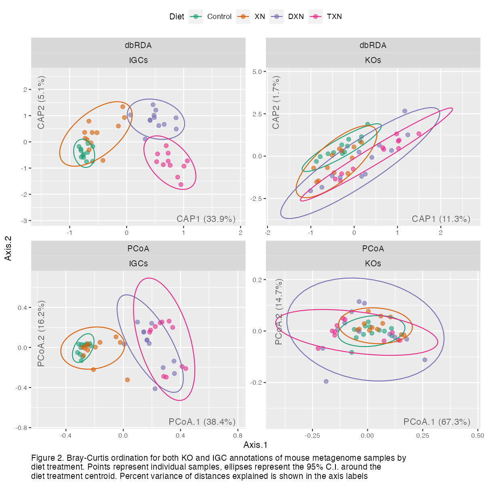

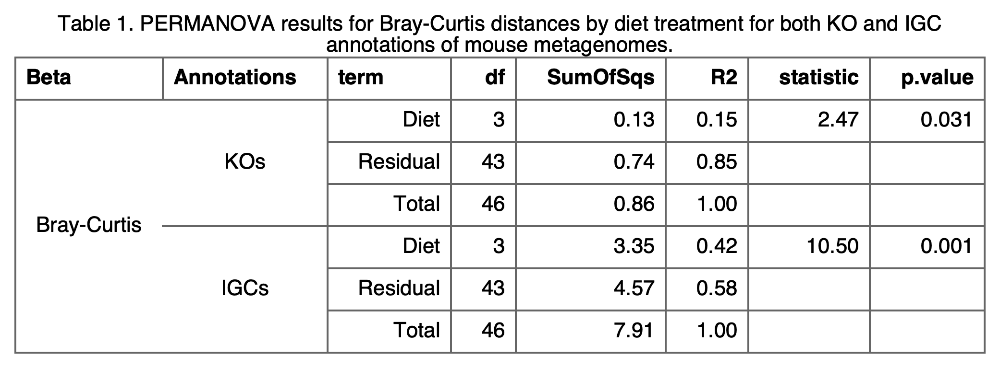

The presence of XN or its derivatives affects the composition of the potential functional capacity of the gut microbiome in mice (Figure 1 & Table 1). The distinctions appear to be clearer when using the IGC data set, rather than the KO set. In either case, however, XN treatment appears to result in metagenomic composition more similar to the controls than DXN or TXN treatments do. It *appears* that the control (HFD) metagenomes have much less beta-dispersion (average distance from the centroid) than the diet treatments.

### Taxonomic (Kraken2) composition

```{r kraken-distance-matrices}
kraken.dist.list.file <- file.path(saveDir, "list_kraken_distance_matrices.rds")

kraken.dist.list <- redo.if("kraken.analyses", kraken.dist.list.file, {
  gen.dist.matrices(
    ps = ps.kraken, 
    methods = "taxonomic", 
    cores = nCores, 
    verbose = T
  ) %>% 
    lapply(., function(x) {
      attributes(x)$call <- NULL
      return(x)
    })
})
```

```{r kraken-pcoa-diet}
plot.env <- new.env()
plot.env$Axis.var <- data.table()
ord.data <- lapply(names(kraken.dist.list), function(beta) {
  ord <- ordinate(
    physeq = ps.kraken, 
    method = "PCoA", 
    distance = kraken.dist.list[[beta]]
  )
  ord.data <- plot_ordination(ps.kraken, ord, justDF = T) %>%
    as.data.table(keep.rownames = "Sample")
  ord.data[, Beta := beta]
  plot.env$Axis.var <- rbind(
    plot.env$Axis.var,
    data.table(
      Beta = beta,
      Var = paste0(round(ord$values$Relative_eig[1:2] * 100, 2), "%"), 
      Axis.1 = c(max(ord.data$Axis.1), min(ord.data$Axis.1)) * 1.5,
      Axis.2 = c(min(ord.data$Axis.2), max(ord.data$Axis.2)) * 1.5,
      Angle = c(0, 90)
    )
  )
  return(ord.data)
}) %>% rbindlist()
plot.env$Axis.var[Angle == 90]$Axis.1[1] <- 
  plot.env$Axis.var[Angle == 90]$Axis.1[1] - 0.7
plot.env$Axis.var[Angle == 90]$Axis.1[2] <- 
  plot.env$Axis.var[Angle == 90]$Axis.1[2] - 0.3

caption <- paste(
  "PCoA ordinations for mouse metagenomic samples. Points represent individual samples, ellipses represent the 95% C.I. around the diet treatment centroid. Both of these are colored by diet treatment. Percent variance in distances explained are presented in gray text near axes."
)
{
  ggplot(ord.data, aes(x = Axis.1, y = Axis.2)) + 
    geom_point(aes(color = Diet), alpha = 0.6, size = 2) + 
    stat_ellipse(aes(color = Diet)) + 
    scale_color_brewer(palette = "Dark2") +
    geom_text(
      data = plot.env$Axis.var,
      aes(label = Var, angle = Angle),
      hjust = 1,
      color = "gray40"
    ) +
    facet_wrap(~ Beta, scales = "free") +
    labs(
      title = "Taxonomic (Kraken2)", 
      x = "PCoA.1", 
      y = "PCoA.2"
    ) +
    gg_figure_caption(caption = caption, caption.width = 120)
} %>% ggsave(
  filename = file.path("Plots/diet_taxonomic_ordination.png"),
  dpi = img.dpi,
  width = img.wd * 1.5,
  height = img.ht * 0.6
)
```

```{r kraken-permanovas, include=FALSE}
cap <- "PERMANOVA results for beta-diversity distances by diet treatment for both taxonomic (Kraken2) annotations of mouse metagenomes."
kraken.aovs.data.file <- file.path(saveDir, "kraken_permanovas_data_dt.rds")
kraken.aovs.data <- redo.if("kraken.analyses", kraken.aovs.data.file, {
  lapply(names(kraken.dist.list), function(beta) {
    dist.mat <- kraken.dist.list[[beta]]
    aov.data <- sample.data.frame(ps.kraken)
    aov <- adonis2(dist.mat ~ Diet, data = aov.data) %>% 
      tidy() %>%
      suppressWarnings() %>%
      as.data.table()
    aov[, Beta := beta]
    setcolorder(aov, 7)
    return(aov)
  }) %>% rbindlist()
}) %>% flextable() %>%
  theme_box() %>%
  set_caption(table.caption(cap)) %>%
  merge_v(j = 1) %>%
  align(j = 1, align = "center") %>%
  align(j = 2, align = "right") %>%
  colformat_double(j = 4:6, digits = 2) %>%
  colformat_double(j = 7, digits = 3) %>%
  autofit() %>%
  save_as_image(path = file.path(plotDir, "kraken_permanova_results.png"))
```

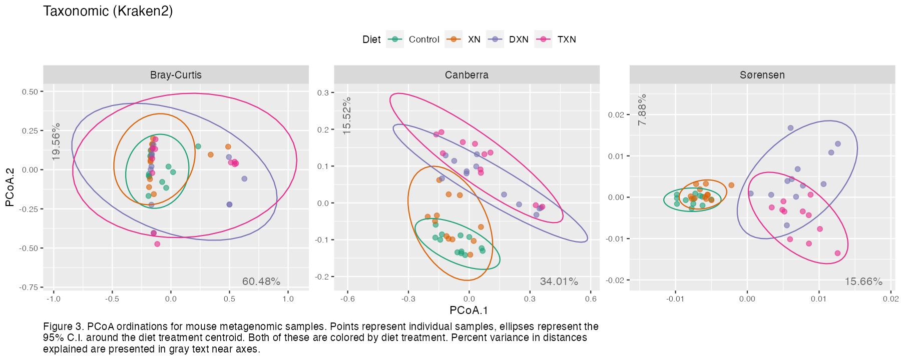

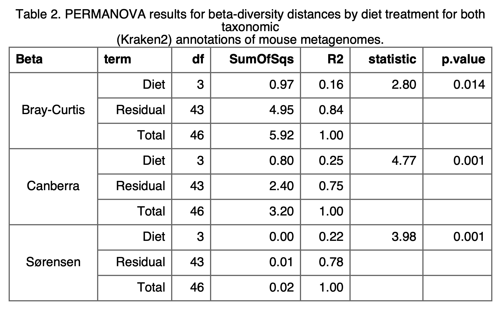

We used Kraken 2 to assign taxonomy to the mouse metagenomic sequences to assess whether administration of XN and its derivatives affects not just the potential functional capacity of the mouse gut microbiome, but also which microbial taxa are present. While there are statistically significant differences for all three distance metics measured (Table 2), the differences in the ordinations indicate some interesting results. Bray-Curtis, which is weighted by abundance, implies that there many high-abundance taxa share across the treatments, while Sørensen (presence-absence) indicates a strong effect of diet treatment on the rarer taxa. That is to say, administration of XN, DXN, and TXN to mice being fed HFDs appears to primarily affect the presence or absence of rare taxa, and have a smaller (but still stastically signficant) effect on the more abundant taxa. As with the functional potential, taxonomic composition of mice supplemented with XN apppears to be more similar to the HFD controls than supplementation with DXN or TXN.

### Associations with individual functional annotations

```{r diet-random-forests}
threshholds <- c(0.95, 0.8, 0.6, 0.4, 0.2, 0)

kw.sig.dt.file <- file.path(
  saveDir, 
  "dt_diet_randForests_imptFeatures_sig_effects.rds"
)
kw.sig.dt <- redo.if("diet.random.forest", kw.sig.dt.file, {
  cl <- makeCluster(nCores, type = "FORK", outfile = "")
  registerDoParallel(cl, nCores)
  
  res.dt <- lapply(annotation.sets, function(set) {
    selected.diet.rf <- gen.diet.random.forests(
      threshholds, 
      physeq = ps.list[[set]]
    )
    
    sig.impt.dt <- id.sig.important.features(
      selected.diet.rf, 
      feature.type = str_remove(set, "s$")
    )
    
    sig.impt.kw.dt <- diet.impt.feature.kw.tests(
      sig.feature.dt = sig.impt.dt,
      physeq = ps.list[[set]],
      feature.type = str_remove(set, "s$")
    )
    names(sig.impt.kw.dt)[1] <- "Feature"
    sig.impt.kw.dt[, Set := set]
    return(sig.impt.kw.dt)
  }) %>% rbindlist()
  
  stopCluster(cl)
  
  res.dt
})

### Manual fix
# kos.sig.dt <- readRDS(
#   file.path(saveDir, "dt_diet_randForests_imptKOs_sig_effects.rds")
# )
# names(kos.sig.dt)[1] <- "Feature"
# kos.sig.dt[, Set := "KOs"]
# setcolorder(kos.sig.dt, 6)
# 
# igc.sig.dt <- readRDS(
#   file.path(saveDir, "dt_diet_randForests_imptIGCs_sig_effects.rds")
# )
# names(igc.sig.dt)[1] <- "Feature"
# igc.sig.dt[, Set := "IGCs"]
# setcolorder(igc.sig.dt, 6)
# 
# kw.sig.dt <- rbind(kos.sig.dt, igc.sig.dt)
# saveRDS(kw.sig.dt, kw.sig.dt.file)
```

```{r diet-models-plot-impt-features}
top.n <- 12
diet.impt.plots <- lapply(annotation.sets, function(set) {
  physeq <- ps.list[[set]]
  top.feats <- kw.sig.dt[Set == set]$Feature[1:top.n]
  feat.mat <- otu.matrix(physeq)
  plot.dt0 <- feat.mat[, top.feats] %>% as.data.table(keep.rownames = "Sample")
  plot.dt0[, Diet := sample.df$Diet]
  plot.dt1 <- melt(
    plot.dt0, 
    id.vars = c("Sample", "Diet"), 
    variable.name = "Feature", 
    value.name = "Abund"
  ) %>%
    setkeyv("Feature")
  if (set == "IGCs") {
    map.tbl <- igc.eggnog.map[top.feats]
    plot.dt <- plot.dt1[map.tbl, on = "Feature==IGC"]
    plot.dt[, Facet.lab := paste0(Feature, " (", Preferred_name, ")")]
    
  } else {
    plot.dt <- copy(plot.dt1)
    plot.dt[, Facet.lab := Feature]
  }
  caption <- paste("Top", top.n, "most important KOs & IGCs for predicting mouse diet according to random forest models that were also significant according to Kruskal-Wallis tests (bonferroni corrected).")
  plot <- ggplot(plot.dt, aes(x = Diet, y = Abund)) + 
    geom_quasirandom(dodge.width = 0.8) + 
    stat_summary(fun.data = "mean_cl_boot", color = "red", geom = "errorbar") + 
    facet_wrap(~ Facet.lab, scales = "free_y", ncol = 4) + 
    labs(y = "Normalized Abundance", title = set)
  if (set == "IGCs") {
    plot <- plot + gg_figure_caption(caption = caption, caption.width = 130)
  }
  return(plot)
})

plot_grid(plotlist = diet.impt.plots, ncol = 1, rel_heights = c(1, 1.1)) %>% 
  ggsave(
    filename = file.path(plotDir, "diet_rf_sig_impt_features.png"),
    dpi = img.dpi,
    width = img.wd * 1.5,
    height = img.ht * 1.5
  )
```

```{r diet-models-plot-impt-kos-tbl, include=FALSE}
diet.rf.impt.ko.tbl <- map.tbl[kw.sig.dt[Set == "KOs"]$Feature[1:top.n]]
names(diet.rf.impt.ko.tbl)[1] <- "KO"
flextable(diet.rf.impt.ko.tbl[order(KO)]) %>%
  theme_box() %>%
  set_caption(
    table.caption("Important (diet random forests) KO Assignments")
  ) %>%
  autofit() %>%
  save_as_image(path = file.path(plotDir, "diet_rf_sig_impt_kos_tbl.png"))
```

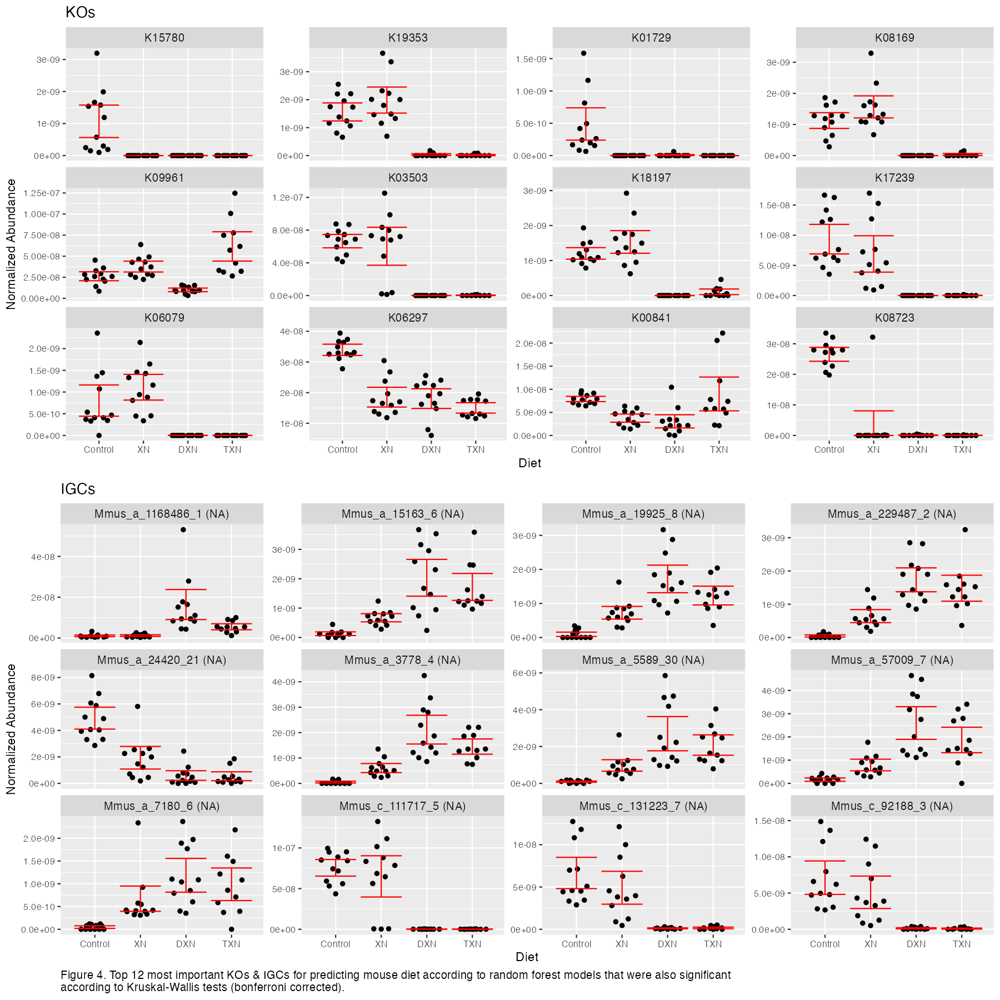

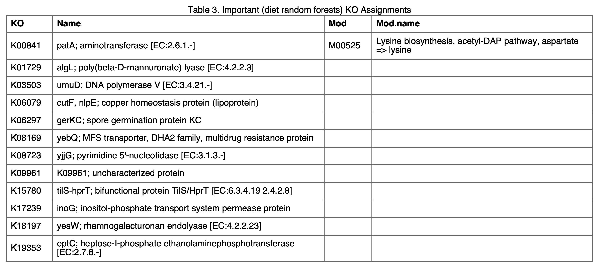

After to assessing the overall composition of the mouse metagenomes, we wanted to determine if there association with diet treatment and specific metagenomic functions. To do so, we created two random forest models, the first using KO abundances and the second using IGC abundances, to predict diet treatment. We assessed feature (KO or IGC abudance) importance through a non-parametric (permutational) method and ploted the abundance-by-diet relationships of the top 12 significantly important features for each data set (Figure 3). Higher level (module) assignments, if determined, are presented in Table 3.

<!-- fix code and fill out text (KOs previously shown to associate with XN) -->

```{r xn-kos-of-interest-plot, include=FALSE}
ko.id.tbl <- readRDS(file.path(inDir, "my_ko_names_and_mod_name.rds"))
search.terms <- c(
  "aromatic amino acid aminotransferase",
  "tryptophanase",
  "tryptophan monooxygenase",
  "tryptophan decarboxylase",
  "indolelactate",
  "indolepyruvate",
  "acyl-coa dehydrogenase",
  "indoleacetate",
  "indoleacetaldehyde",
  "indoleacetamide",
  "cytochrome P450 family 2 subfamily E",
  "sulfotransferase",
  "enoate reductase"
)
xn.kos <- ko.id.tbl[
  grepl(paste(search.terms, collapse = "|"), ko.name, ignore.case = T)
]$ko %>% unique()
ko.dt <- otu.data.table(ps.list$KOs)
ko.vec <- names(ko.dt)[-1]
keep.kos <- c("Sample", ko.vec[ko.vec %in% xn.kos])
xn.ko.dt <- ko.dt[, ..keep.kos]
xn.ko.plot.dt <- sample.data.table(ps.kos)[xn.ko.dt, on = "Sample"] %>%
  melt(
    id.vars = "Diet", 
    measure.vars = keep.kos[-1], 
    variable.name = "KO", 
    value.name = "Abund"
  )
xn.ko.plot.dt[, KO := factor(KO, levels = sort(levels(KO)))]
fig.cap <- "Abundance by diet treatment for KOs whose description matches key terms identified as associating with XN (or derivatives) in prior work."
{
  ggplot(xn.ko.plot.dt, aes(x = Diet, y = Abund)) +
    stat_summary(fun.data = "mean_cl_boot", geom = "errorbar") + 
    geom_quasirandom(aes(color = Diet), groupOnX = T) + 
    scale_color_brewer(palette = "Dark2") + 
    facet_wrap(~ KO, scales = "free_y", ncol = 4) + 
    gg_figure_caption(caption = fig.cap)
} %>%
  ggsave(
    filename = file.path(plotDir, "diet_xn_kos_of_interest.png"),
    dpi = img.dpi,
    width = img.wd,
    height = img.ht * 0.6
  )

xn.ko.tbl <- ko.id.tbl[ko %in% ko.vec[ko.vec %in% xn.kos]]
names(xn.ko.tbl) <- c("KO", "Name", "Mod", "Mod.name")
flextable(xn.ko.tbl[order(KO)]) %>%
  theme_box() %>%
  set_caption(
    table.caption("Module assignments for XN-related KOs of interest.")
  ) %>%
  autofit() %>%
  save_as_image(path = file.path(plotDir, "diet_xn_kos_of_interest_tbl.png"))
```

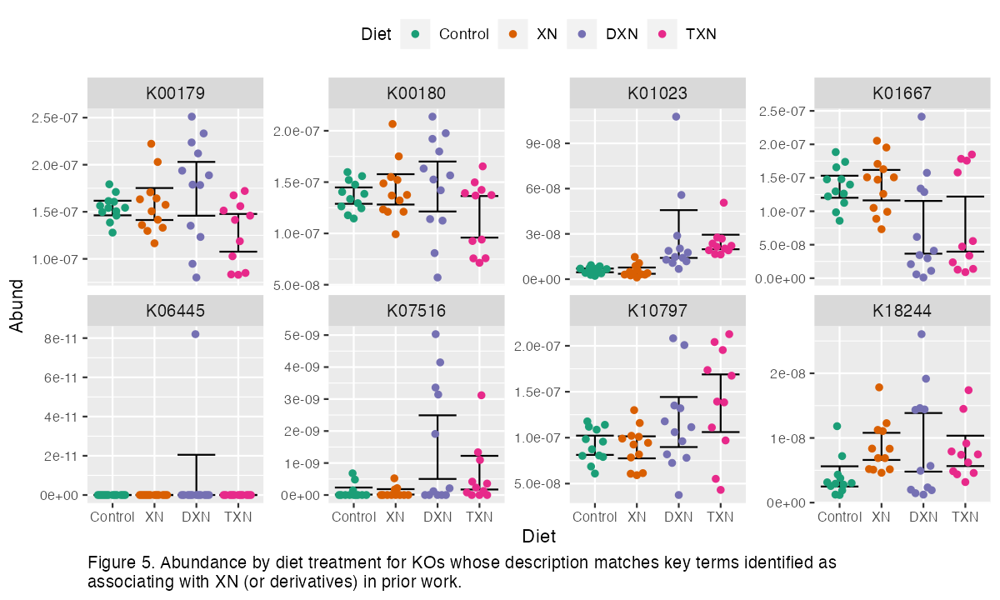

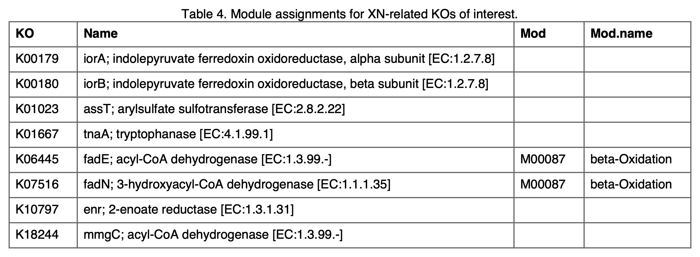

Previous work had identified particular KOs that associated with XN diet supplementation. We search for KOs in this work that matched any of a set of keywords from that prior work and plotted their abundances by diet treatment.

## Diet and Spatial Learning covariate interactions

### Differences in overall composition (beta-diversity)

#### Methods

1.  Generate dbRDA ordinations with all Spatial Learning covariates
2.  Use `ordistep` to select Spatial Learning covariates that explain the most variance in beta-diversity
3.  Significance assessment on `ordistep`-selected dbRDAs with permanova
4.  Add in diet term (main effect)
5.  More tests of significance
6.  Add in diet term interactions to full models
7.  Use `ordistep` to select Spatial Learning covariates by Diet interactions that explain the most variance in beta-diversity
8.  Significance assessment on `ordistep`-selected dbRDAs with permanova

```{r diet-and-covars-dbrdas, include=FALSE}
full.dbrdas.file <- file.path(saveDir, "lists_full_dbRDAs.rds")
dbrda.frm0 <- paste("dist ~", paste(spat.learn.vars, collapse = " + "))
full.dbrdas <-redo.if("diet.by.covars", save.file = full.dbrdas.file, {
  lapply(annotation.sets, function(set) {
    par.dbrdas(
      dist.mats = dist.lists[[set]], 
      dbrda.frm = dbrda.frm0,
      sample.data = sample.df, 
      nCores = nCores
    ) %>% return()
  })
})

select.dbrdas.file <- file.path(saveDir, "lists_selected_dbRDAs.rds")
select.dbrdas <- redo.if("diet.by.covars", save.file = select.dbrdas.file, {
  lapply(annotation.sets, function(set) {
    par.ordistep(
      full.dbrdas = full.dbrdas[[set]],
      selectDirection = "both",
      nCores = nCores
    )
  }) %>% return()
})

dbrda.anovas.file <- file.path(saveDir, "lists_dbRDA_permanovas.rds")
dbrda.anovas <- redo.if("diet.by.covars", save.file = dbrda.anovas.file, {
  lapply(annotation.sets, function(set) {
    par.anova.rda(
      select.dbrdas[[set]], 
      by.what = "margin", 
      nCores = nCores
    )
  })
})
# print.list(dbrda.anovas) ### 

selectTreat.dbrdas.file <- file.path(
  saveDir, 
  "list_selected_dbRDAs_with_dietTreatment.rds"
)
selectTreat.dbrdas <- redo.if("diet.by.covars", selectTreat.dbrdas.file, {
  cl <- makeCluster(nCores, type = "FORK", outfile = "")
  registerDoParallel(cl, nCores)
  res.list <- lapply(annotation.sets, function(set) {
    foreach(
      n = names(select.dbrdas[[set]]),
      .final = function(x) setNames(x, names(select.dbrdas[[set]])),
      .verbose = TRUE
    ) %dopar% {
      dbrda.s <- select.dbrdas[[set]][[n]]
      dbrda.selectTreat <- update(dbrda.s, . ~ . + Diet)
      return(dbrda.selectTreat)
    }
  })
  stopCluster(cl)
  res.list
})

dbrda.treat.anovas.file <- file.path(
  saveDir, 
  "list_dbRDA_permanovas_with_dietTreatment.rds"
)
dbrda.treat.anovas <- redo.if("diet.by.covars", dbrda.treat.anovas.file, {
  lapply(annotation.sets, function(set) {
    par.anova.rda(
      selectTreat.dbrdas[[set]], 
      by.what = "margin", 
      nCores = nCores
    )
  })
})
# print.list(dbrda.treat.anovas) ### 

intrxn.full.dbrdas.file <- file.path(saveDir, "list_full_interactions_dbRDAs.rds")
dbrda.int0.frm <- paste(
  "dist ~ Diet +", paste(paste0("Diet:", spat.learn.vars), collapse = " + ")
)
intrxn.full.dbrdas <- redo.if("diet.by.covars", intrxn.full.dbrdas.file, {
  lapply(annotation.sets, function(set) {
    par.dbrdas(
      dist.mats = dist.lists[[set]], 
      dbrda.frm = dbrda.int0.frm,
      sample.data = sample.df,
      nCores = nCores
    )
  })
})

intrxn.select.dbrdas.file <- file.path(
  saveDir, "list_selected_interactions_dbRDAs.rds"
)
intrxn.select.dbrdas <- redo.if("diet.by.covars", intrxn.select.dbrdas.file, {
  lapply(annotation.sets, function(set) {
    par.ordistep(
      full.dbrdas = intrxn.full.dbrdas[[set]],
      selectDirection = "both",
      nCores = nCores
    )
  })
})

dbrda.intrxn.anovas.file <- file.path(
  saveDir, 
  "list_interaction_dbRDA_permanovas.rds"
)
dbrda.intrxn.anovas <- redo.if("diet.by.covars", dbrda.intrxn.anovas.file, {
  lapply(annotation.sets, function(set) {
    par.anova.rda(
      intrxn.select.dbrdas[[set]], 
      by.what = "margin", 
      nCores = nCores
    )
  })
})

cap <- "PERMANOVA results for beta-diversity distances by diet treatment and spatial learning covariate interactions for both KO and IGC annotations of mouse metagenomes."
lapply(annotation.sets, function(set) {
  lapply(names(dbrda.intrxn.anovas[[set]]), function(beta) {
    aov.dt <- dbrda.intrxn.anovas[[set]][[beta]] %>% 
      tidy() %>% 
      as.data.table() %>%
      suppressWarnings()
    aov.dt[, `:=`(Set = set, Beta = beta)]
    setcolorder(aov.dt, 6:7)
  }) %>% rbindlist()
}) %>% 
  rbindlist() %>% 
  flextable() %>%
  theme_box() %>%
  set_caption(table.caption(cap)) %>%
  merge_v(j = 1:2) %>%
  align(j = 1:2, align = "center") %>%
  align(j = 3, align = "right") %>%
  colformat_double(j = 5:6, digits = 2) %>%
  colformat_double(j = 7, digits = 3) %>%
  autofit() %>%
  save_as_image(
    path = file.path(plotDir, "diet_by_covars_permanova_results.png")
  )
```

```{r diet-and-covars-dbrda-plots}
beta <- "Bray-Curtis"
caption <- paste(
  "dbRDA ordinations of", beta, "distances of IGC and KO composition for mouse microbiome samples. Circles represent individual samples; arrows indicate vectors of greatest change for the significant spatial learning covariate (indicated by the panel label) by diet treatment interaction term from the PERMANOVA results. Both of these are colored by diet treatment. Percent variance in", beta, "distance explained is presented in parentheses in the axis labels."
)
diet.covars.plots <- lapply(annotation.sets, function(set) {
  dbrda.obj <- intrxn.select.dbrdas[[set]][[beta]]
  permanova.dt <- dbrda.intrxn.anovas[[set]][[beta]] %>%
    tidy() %>%
    as.data.table() %>%
    suppressWarnings()
  sig.spat.vars <- str_split(permanova.dt[p.value <= 0.05]$term, ":") %>%
    sapply(`[`, 2)
  biplot.data <- get.biplot.data(
    smpls = ps.list[[set]], 
    ord = dbrda.obj, 
    plot.axes = c(1, 2)
  )
  sample.coords <- melt(
    biplot.data$sample.coords, 
    id.vars = c("Sample", "CAP1", "CAP2", "Diet"), 
    measure.vars = sig.spat.vars,
    variable.name = "Spat.Var"
  )
  vector.coords <- biplot.data$vector.coords[
    str_detect(Variable, paste(sig.spat.vars, collapse = "|"))
  ]
  vector.coords[, Spat.Var := sapply(str_split(Variable, ":"), `[`, 2)]
  vector.coords[, Diet := str_remove(str_remove(Variable, "Diet"), ":.*")]
  centroid.coords0 <- biplot.data$centroid.coords
  centroid.coords0[, Diet := sub("Diet", "", Variable)]
  centroid.coords <- lapply(sig.spat.vars, function(var) {
    dt <- copy(centroid.coords0)
    dt[, Spat.Var := var]
  }) %>% rbindlist()
  
  dbrda.plot <- ggplot(sample.coords, aes(x = CAP1, y = CAP2, color = Diet)) + 
    geom_point(alpha = 0.3, size = 2) + 
    # geom_point(data = centroid.coords, shape = 3, alpha = 0.5, size = 4) +
    geom_segment(
      data = vector.coords,
      x = 0, y = 0,
      aes(xend = CAP1, yend = CAP2),
      arrow = arrow(length = unit(0.03, "npc"))
    ) + 
    labs(
      title = set,
      subtitle = beta,
      x = biplot.data$axes.labs[1], 
      y = biplot.data$axes.labs[2]
    ) + 
    facet_wrap(~ Spat.Var) + 
    scale_color_brewer(palette = "Dark2") +
    theme(legend.position = "top")
  
  if (set == "KOs") {
    dbrda.plot <- dbrda.plot + 
      gg_figure_caption(caption = caption, caption.width = 160)
  }
  return(dbrda.plot)
})

plot_grid(
  diet.covars.plots[[1]],
  plot_grid(diet.covars.plots[[2]], NULL, ncol = 1, rel_heights = c(1.1, 2)),
  nrow = 1,
  rel_widths = c(2.6, 1)
) %>% ggsave(
  filename = file.path(plotDir, "diet_by_covars_ordinations.png"),
  dpi = img.dpi,
  width = img.wd * 2,
  height = img.ht * 1.5
)
```

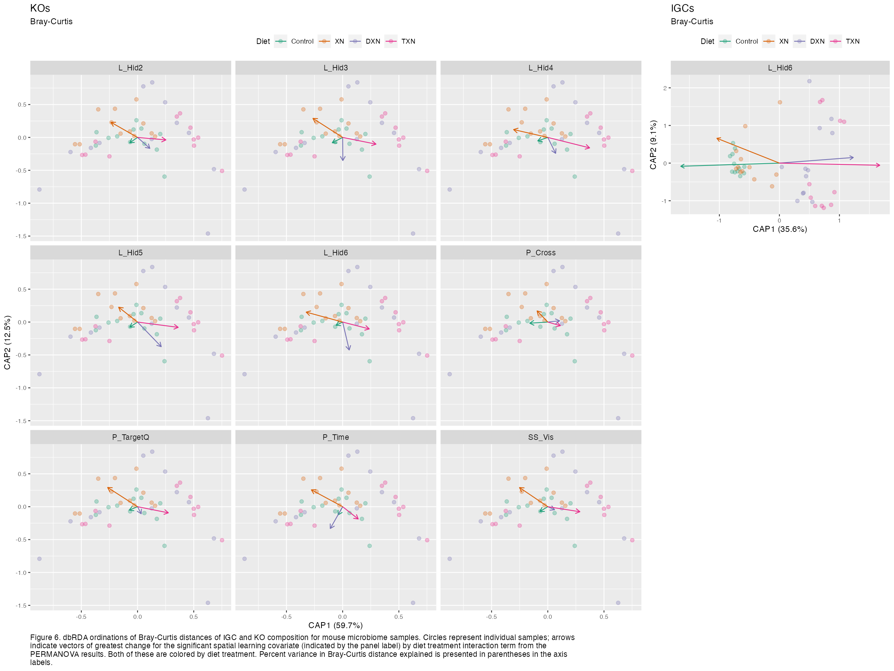

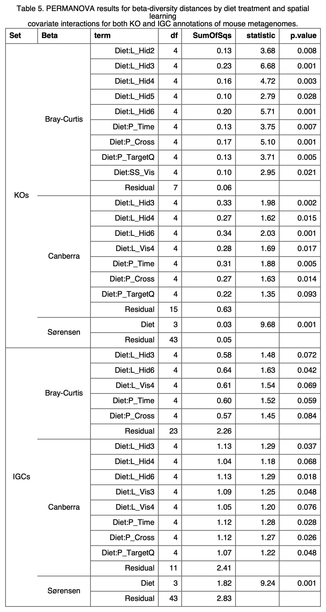

Distance-based redundancy analysis (dbRDA) revealed a number of significant interactions between diet treatment and spatial learning covariates in predicting differences in metagenomic composition (Figure 4 & Table 4). Significant interactions, in this case, implies that the association between a given spatial learning covariate score and metagenomic composition is dependent on which diet treatment (control, XN, DXN, or TXN) the mouse received. Of note, selection on models predicting Sørensen (presence-absence) scores return no significant interactions between diet and spatial learning covariates, while Bray-Curtis and Canberra (both abundance-weighted) did. This implies that the spatial learning covariates associate with changes in abundance of ceratain (probably overall abundant) microbial taxa, rather than the presence or absence of particular microbial taxa.

### Associations with individual functional annotations

```{r covar-modelling}
threshholds <- c(0.95, 0.8, 0.6, 0.4, 0.2, 0)
covars <- names(sample.df)[-1]

glm.sig.dt.file <- file.path(
  saveDir,
  "dt_allCovar_randForests_imptFeature_sig_interactions.rds"
)
glm.sig.dt <- redo.if("covar.random.forest", glm.sig.dt.file, {
  cl <- makeCluster(nCores, type = "FORK", outfile = "")
  registerDoParallel(cl, nCores)
  res.dt <- lapply(annotation.sets, function(set) {
    ft <- str_remove(set, "s$")
    rf.list <- gen.covar.random.forests(
      covars = covars, 
      threshholds = threshholds, 
      physeq = ps.list[[set]], 
      feature.type = ft
    )
    all.sig.impt.dt <- id.sig.important.features(rf.list, feature.type = ft)
    trans.and.cat.dt <- trans.and.cat.covars(copy(sample.dt), covars)
    res <- covar.impt.feature.regressions(
      covars = covars, 
      sig.feature.dt = all.sig.impt.dt,
      covar.dt = trans.and.cat.dt,
      physeq = ps.list[[set]],
      feature.type = ft
    )
    names(res)[2] <- "Feature"
    res[, Set := set]
    setcolorder(res, 4)
    return(res)
  }) %>% rbindlist()
  stopCluster(cl)
  res.dt[Intrxn.pval < 0.05]
})

### Manual fix
# old.files <- list(
#   IGCs = file.path(
#     saveDir,
#     "dt_allCovar_randForests_imptIGCs_sig_interactions.rds"
#   ),
#   KOs =  file.path(
#     saveDir, 
#     "dt_allCovar_randForests_imptKOs_sig_interactions.rds"
#   )
# )
# glm.sig.dt <- lapply(annotation.sets, function(set) {
#   old.dt <- readRDS(old.files[[set]])
#   names(old.dt)[2] <- "Feature"
#   old.dt[, Set := set]
#   setcolorder(old.dt, 4)
#   return(old.dt)
# }) %>% rbindlist()
# glm.sig.dt <- glm.sig.dt[Intrxn.pval < 0.05]
# saveRDS(glm.sig.dt, glm.sig.dt.file)
```

```{r covar-modelling-table}
names(igc.eggnog.map) <- c("Feature", "Name")
glms.sig.igc.dt <- igc.eggnog.map[glm.sig.dt[Set == "IGCs"], on = "Feature"]
glms.sig.kos.dt <- map.tbl[
  glm.sig.dt[Set == "KOs" & Feature != "Diet"], 
  on = "Feature"
]
all.names <- unique(c(names(glms.sig.igc.dt), names(glms.sig.kos.dt)))
names.ordered <- all.names[c(3, 1:2, 6:7, 4:5)]
for (col.name in names.ordered[!(names.ordered %in% names(glms.sig.igc.dt))]) {
  glms.sig.igc.dt[[col.name]] <- NA
}
glms.sig.igc.dt <- glms.sig.igc.dt[, ..names.ordered]
print.glm.sig.dt <- rbind(glms.sig.igc.dt, glms.sig.kos.dt)

write.table(
  print.glm.sig.dt[order(Set, Covar, Feature)], 
  file = file.path(plotDir, "diet_by_covars_rf_sig_impt_features_table.csv"),
  row.names = FALSE,
  sep = ","
)
```

```{r covar-modelling-plots}
modelling.plotDir <- "Plots/Diet_by_covar_rf_sig_impt_features_plots"
trans.and.cat.res <- lapply(annotation.sets, function(set) {
  trans.and.cat.covars(
    dt = sample.data.table(ps.list[[set]]), 
    covars = covars, 
    reference = T
  ) %>% return()
})
sig.features.dt <- lapply(annotation.sets, function(set) {
  if (set == "IGCs") {
    res <- igc.eggnog.map[glm.sig.dt[Set == "IGCs"], on = "Feature"]
    names(res)[1] <- "Feature"
    setcolorder(res, c(3:4, 1:2, 5))
  } else {
    res <- glm.sig.dt[Set == "KOs" & Feature != "Diet"]
    res[, Name := NA]
    setcolorder(res, c(1:3, 5, 4))
  }
  return(res)
}) %>% rbindlist()

# covar <- covars[1]
# set <- "IGCs"
to.plot <- lapply(covars, function(covar) {
  covar.plots <- lapply(annotation.sets, function(set) {
    linear.plot <- !trans.and.cat.res[[set]]$REF.DT[Covar == covar]$Categorized
    if (linear.plot) {
      plot.linear.interactions(
        covar = covar, 
        covar.dt = trans.and.cat.res[[set]]$DT,
        ref.dt = trans.and.cat.res[[set]]$REF.DT,
        sig.features.dt = sig.features.dt[Set == set],
        physeq = ps.list[[set]],
        feature.type = str_remove(set, "s$")
      )
    } else {
      plot.logistic.interactions(
        covar = covar, 
        covar.dt = trans.and.cat.res[[set]]$DT,
        sig.features.dt = sig.features.dt[Set == set],
        physeq = ps.list[[set]],
        feature.type = str_remove(set, "s$")
      )
    }
  })
  
  grid.data <- lapply(covar.plots, function(plot) {
    panels <- ggplot_build(plot)$data[[1]]$PANEL %>%
      as.numeric() %>%
      max()
    nrows <- ifelse(
      panels %in% 7:8, 3, ifelse(panels > 3, floor(sqrt(panels)), 1)
    )
    data.table(
      Panels = panels,
      Rows = nrows,
      Cols = ceiling(panels / nrows)
    )
  }) %>% rbindlist()
  
  top.panel <- covar.plots[[1]]
  bottom.panel <- covar.plots[[2]]
  
  col.diff <- abs(diff(grid.data$Cols))
  if (col.diff != 0) {
    if (grid.data$Cols[1] < grid.data$Cols[2]) {
      top.panel.list <- c(list(covar.plots[[1]]), as.list(rep("", col.diff)))
      for (i in 2:(col.diff + 1)) {
        top.panel.list[i] <- list(NULL)
      }
      top.panel <- plot_grid(
        plotlist = top.panel.list, 
        nrow = 1,
        rel_widths = c(max(c(grid.data$Cols[1], 1.2)), rep(1, col.diff))
      )
    } else {
      bottom.panel.list <- top.panel.list <- c(
        list(covar.plots[[2]]), 
        as.list(rep("", col.diff))
      )
      for (i in 2:(col.diff + 1)) {
        bottom.panel.list[i] <- list(NULL)
      }
      bottom.panel <- plot_grid(
        plotlist = bottom.panel.list, 
        nrow = 1,
        rel_widths = c(max(c(grid.data$Cols[2], 1.2)), rep(1, col.diff))
      )
    }
  }
  rel.hts <- grid.data$Rows
  rel.hts[rel.hts == 1] <- 1.2
  fig.wd <- max(c(img.wd * max(grid.data$Cols) / 2, img.wd))
  fig.ht <- max(c(img.ht * sum(grid.data$Rows) / 3), img.ht)
  plot_grid(
    top.panel,
    bottom.panel,
    ncol = 1,
    rel_heights = rel.hts
  ) %>%
    ggsave(
      filename = file.path(modelling.plotDir, paste0(covar, ".png")),
      dpi = img.dpi,
      width = fig.wd,
      height = fig.ht
    )
})
```

As with diet treatment, we created a set of random forest models to predict spatial learning covariate scores from feature (KO or IGC) abundances. We then used the models to assess which features were significanly important. Using only these important features, we built regression models to assess whether feature abundance by diet interactions significantly predicted spatial learning covariate scores. As the table and figure below indicate, there were a number of IGCs and KOs that significantly associated with spatial learning covariates in a diet-dependent manner. For example, K21600 (csoR, ricR; CsoR family transcriptional regulator, copper-sensing transcriptional repressor) had a positive association with L_Vis1 scores in control and XN-supplemented mice, but a negative association with L_Vis1 scores in DXN- and TXN-supplmented mice, and K00566 (mnmA, trmU; tRNA-uridine 2-sulfurtransferase) had a negative association with L_Hid6 scores in control samples, but positive associations with L_Hi6 scores for all three supplemented samples.

This [CSV table](Plots/diet_by_covars_rf_sig_impt_features_table.csv) reports all significant associations between metagenomic functional features and behavioral covariate by diet interactions ([PNG version](Plots/diet_by_covars_rf_sig_impt_features_table.png))

All significant associations between spatial learning covariates and diet by KO/IGC abundance interactions can be found in [this directory](Plots/Diet_by_covar_rf_sig_impt_features_plots).

## Diet and ceramide interactions

One possible contribution to the effects of HFDs on metabolic syndrome is the increased concentrations of sphingolipids (including ceramides) in the brain and liver. We measured ceramide concentrations in both of these tissues of the mouse samples, and determined whether there were significant associtation between these concentrations and metagenomic composition in a diet-dependent manner.

### Differences in overall composition (beta-diversity)

*Same methodology as above*

```{r diet-and-ceramide-dbrdas, include=FALSE}
ceramide.df <- as.data.frame(ceramide.dt) %>%
  set_rownames(ceramide.dt$Sample)
ceramide.df$Sample <- NULL
ceramide.dist.lists <- lapply(annotation.sets, function(set) {
  lapply(dist.lists[[set]], function(mat) {
    usedist::dist_subset(mat, rownames(ceramide.df))
  })
})

full.cer.dbrdas.file <- file.path(saveDir, "lists_full_dbRDAs_ceramide.rds")
dbrda.frm0 <- paste("dist ~", paste(ceramide.ids, collapse = " + "))
full.cer.dbrdas <- redo.if("diet.by.ceramide", full.cer.dbrdas.file, {
  lapply(annotation.sets, function(set) {
    par.dbrdas(
      dist.mats = ceramide.dist.lists[[set]], 
      dbrda.frm = dbrda.frm0,
      sample.data = ceramide.df, 
      nCores = nCores
    ) %>% return()
  })
})

select.cer.dbrdas.file <- file.path(saveDir, "lists_selected_dbRDAs_ceramide.rds")
select.cer.dbrdas <- redo.if("diet.by.ceramide", select.cer.dbrdas.file, {
  lapply(annotation.sets, function(set) {
    par.ordistep(
      full.dbrdas = full.cer.dbrdas[[set]],
      selectDirection = "both",
      nCores = nCores
    )
  }) %>% return()
})

dbrda.cer.anovas.file <- file.path(saveDir, "lists_dbRDA_permanovas_ceramide.rds")
dbrda.cer.anovas <- redo.if("diet.by.ceramide", dbrda.cer.anovas.file, {
  lapply(annotation.sets, function(set) {
    par.anova.rda(
      dbrdas =select.cer.dbrdas[[set]], 
      by.what = "margin", 
      nCores = nCores
    )
  })
})
# print.list(dbrda.cer.anovas) ### 

selectTreat.cer.dbrdas.file <- file.path(
  saveDir, 
  "list_selected_dbRDAs_with_dietTreatment_ceramide.rds"
)
selectTreat.cer.dbrdas <- redo.if("diet.by.ceramide", selectTreat.cer.dbrdas.file, {
  cl <- makeCluster(nCores, type = "FORK", outfile = "")
  registerDoParallel(cl, nCores)
  res.list <- lapply(annotation.sets, function(set) {
    foreach(
      n = names(select.cer.dbrdas[[set]]),
      .final = function(x) setNames(x, names(select.cer.dbrdas[[set]])),
      .verbose = TRUE
    ) %dopar% {
      dbrda.s <- select.cer.dbrdas[[set]][[n]]
      dbrda.selectTreat <- update(dbrda.s, . ~ . + Diet)
      return(dbrda.selectTreat)
    }
  })
  stopCluster(cl)
  res.list
})

dbrda.treat.cer.anovas.file <- file.path(
  saveDir, 
  "list_dbRDA_permanovas_with_dietTreatment_ceramide.rds"
)
dbrda.treat.cer.anovas <- redo.if("diet.by.ceramide", dbrda.treat.cer.anovas.file, {
  lapply(annotation.sets, function(set) {
    par.anova.rda(
      dbrdas = selectTreat.cer.dbrdas[[set]], 
      by.what = "margin", 
      nCores = nCores
    )
  })
})
# print.list(dbrda.treat.cer.anovas) ### 

intrxn.full.cer.dbrdas.file <- file.path(saveDir, "list_full_interactions_dbRDAs_ceramide.rds")
dbrda.int0.frm <- paste(
  "dist ~ Diet +", 
  paste(paste0("Diet:", ceramide.ids), collapse = " + ")
)
intrxn.full.cer.dbrdas <- redo.if("diet.by.ceramide", intrxn.full.cer.dbrdas.file, {
  lapply(annotation.sets, function(set) {
    par.dbrdas(
      dist.mats = ceramide.dist.lists[[set]], 
      dbrda.frm = dbrda.int0.frm,
      sample.data = ceramide.df,
      nCores = nCores
    )
  })
})

intrxn.select.cer.dbrdas.file <- file.path(
  saveDir, "list_selected_interactions_dbRDAs_ceramide.rds"
)
intrxn.select.cer.dbrdas <- redo.if("diet.by.ceramide", intrxn.select.cer.dbrdas.file, {
  lapply(annotation.sets, function(set) {
    par.ordistep(
      full.dbrdas = intrxn.full.cer.dbrdas[[set]],
      selectDirection = "both",
      nCores = nCores
    )
  })
})

dbrda.intrxn.cer.anovas.file <- file.path(
  saveDir, 
  "list_interaction_dbRDA_permanovas_ceramide.rds"
)
dbrda.intrxn.cer.anovas <- redo.if("diet.by.ceramide", dbrda.intrxn.cer.anovas.file, {
  lapply(annotation.sets, function(set) {
    par.anova.rda(
      intrxn.select.cer.dbrdas[[set]], 
      by.what = "margin", 
      nCores = nCores
    )
  })
})

cap <- "PERMANOVA results for beta-diversity distances by diet treatment and ceramide concentration interactions for both KO and IGC annotations of mouse metagenomes."
dbrda.intrxn.cer.anova.tbl <- lapply(annotation.sets, function(set) {
  lapply(names(dbrda.intrxn.cer.anovas[[set]]), function(beta) {
    aov.dt <- dbrda.intrxn.cer.anovas[[set]][[beta]] %>% 
      tidy() %>% 
      as.data.table() %>%
      suppressWarnings()
    aov.dt[, `:=`(Set = set, Beta = beta)]
    setcolorder(aov.dt, 6:7)
  }) %>% rbindlist()
}) %>% rbindlist() 
term.vars <- str_split(dbrda.intrxn.cer.anova.tbl$term, ":") %>%
  sapply(tail, 1)
term.labs <- paste(
  str_remove(ceramide.leg[term.vars]$Category, " sphingolipids| lipidomics"),
  str_remove(ceramide.leg[term.vars]$Label, " ceramide"),
  sep = "_"
)
term.labs <- term.labs[term.labs != "NA_NA"]
dbrda.intrxn.cer.anova.tbl[str_detect(term, "Diet:")]$term <- paste0(
  "Diet:", term.labs
)

flextable(dbrda.intrxn.cer.anova.tbl) %>%
  theme_box() %>%
  set_caption(table.caption(cap)) %>%
  merge_v(j = 1:2) %>%
  align(j = 1:2, align = "center") %>%
  align(j = 3, align = "right") %>%
  colformat_double(j = 5:6, digits = 2) %>%
  colformat_double(j = 7, digits = 3) %>%
  autofit() %>%
  save_as_image(
    path = file.path(plotDir, "diet_by_ceramide_permanova_results.png")
  )
```

```{r diet-and-ceramide-dbrda-plots}
beta <- "Bray-Curtis"
caption <- paste(
  "dbRDA ordinations of", beta, "distances of IGC and KO composition for mouse microbiome samples. Circles represent individual samples; arrows indicate vectors of greatest change for the significant ceramide concentration (indicated by the panel label) by diet treatment interaction term from the PERMANOVA results. Both of these are colored by diet treatment. Percent variance in", beta, "distance explained is presented in parentheses in the axis labels."
)
set.tracking.nums(set.to = 5)
diet.ceramide.plots <- lapply(annotation.sets, function(set) {
  dbrda.obj <- intrxn.select.cer.dbrdas[[set]][[beta]]
  permanova.dt <- dbrda.intrxn.cer.anovas[[set]][[beta]] %>%
    tidy() %>%
    as.data.table() %>%
    suppressWarnings()
  sig.cer.vars <- str_split(permanova.dt[p.value <= 0.05]$term, ":") %>%
    sapply(`[`, 2)
  biplot.data <- get.biplot.data(
    smpls = ps.list[[set]], 
    ord = dbrda.obj, 
    plot.axes = c(1, 2)
  )
  sample.coords <- melt(
    biplot.data$sample.coords[ceramide.dt], 
    id.vars = c("Sample", "CAP1", "CAP2", "Diet"), 
    measure.vars = sig.cer.vars,
    variable.name = "Ceramide.ID"
  )
  sample.coords[
    , Ceramide.Lab := paste(
      str_remove(
        ceramide.leg[as.character(Ceramide.ID)]$Category, 
        " sphingolipids|lipidomics"
      ),
      str_remove(ceramide.leg[as.character(Ceramide.ID)]$Label, " ceramide")
    )
  ]
  
  vector.coords <- biplot.data$vector.coords[
    str_detect(Variable, paste(sig.cer.vars, collapse = "|"))
  ]
  vector.coords[, Ceramide.ID := sapply(str_split(Variable, ":"), `[`, 2)]
  vector.coords[, Diet := str_remove(str_remove(Variable, "Diet"), ":.*")]
  vector.coords[
    , Ceramide.Lab := paste(
      str_remove(
        ceramide.leg[Ceramide.ID]$Category, 
        " sphingolipids|lipidomics"
        ),
      str_remove(ceramide.leg[Ceramide.ID]$Label, " ceramide")
    )
  ]
  vector.coords[
    , Vector.Lab := paste0(
      str_remove(Variable, "var[0-9][0-9]*"),
      Ceramide.Lab
    )
  ]
  centroid.coords0 <- biplot.data$centroid.coords
  centroid.coords0[, Diet := sub("Diet", "", Variable)]
  centroid.coords <- lapply(sig.cer.vars, function(var) {
    dt <- copy(centroid.coords0)
    dt[, Ceramide.ID := var]
  }) %>% rbindlist()
  
  dbrda.plot <- ggplot(sample.coords, aes(x = CAP1, y = CAP2, color = Diet)) + 
    geom_point(shape = 19, size = 4) + 
    geom_point(
      aes(fill = value), 
      shape = 21, 
      size = 2.5
      ) +
    geom_segment(
      data = vector.coords,
      x = 0, y = 0,
      aes(xend = CAP1, yend = CAP2),
      arrow = arrow(length = unit(0.03, "npc"))
    ) + 
    labs(
      title = set,
      subtitle = beta,
      x = biplot.data$axes.labs[1], 
      y = biplot.data$axes.labs[2]
    ) + 
    facet_wrap(~ Ceramide.Lab) + 
    scale_color_brewer(palette = "Dark2") +
    scale_fill_gradient(
      name = "Normalized Ceramide Concentration", 
      low = "white", 
      high = "black"
      ) +
    theme(legend.position = "top")
  
  if (set == "IGCs") {
    dbrda.plot <- dbrda.plot + 
      gg_figure_caption(caption = caption, caption.width = 110)
  }
  return(dbrda.plot)
})

plot_grid(
  plotlist = diet.ceramide.plots,
  ncol = 1,
  rel_heights = c(2, 1.3)
) %>% ggsave(
  filename = file.path(plotDir, "diet_by_ceramide_ordinations.png"),
  dpi = img.dpi,
  width = img.wd * 1.5,
  height = img.ht * 2
)
```

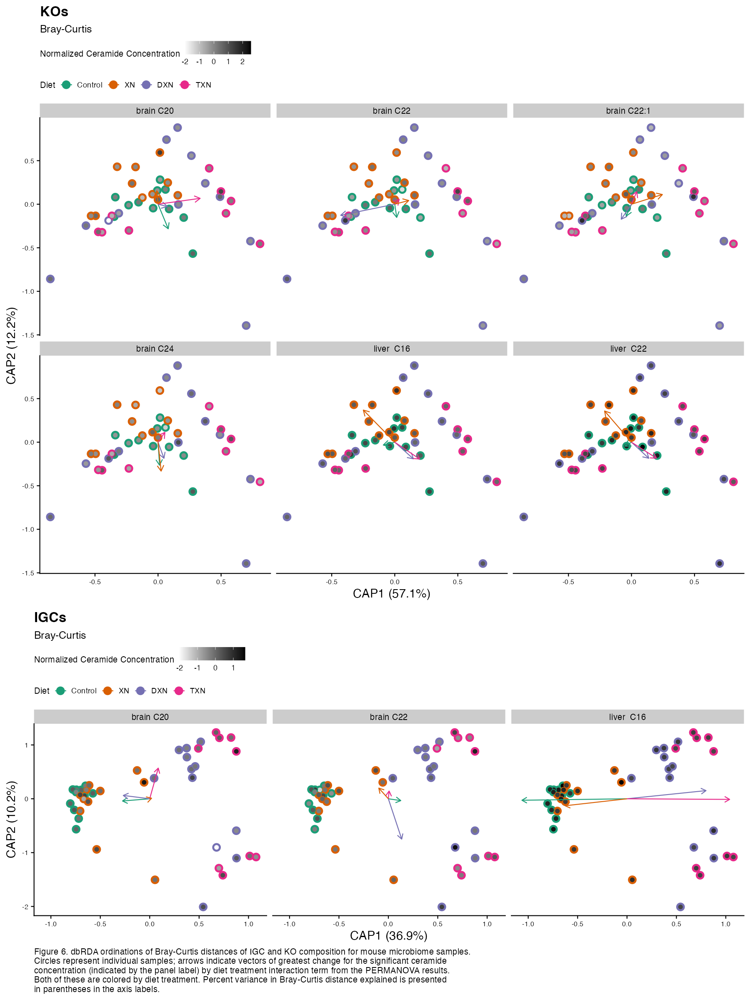

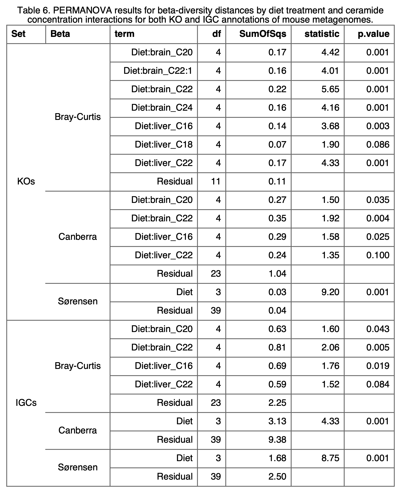

The KOs dataset yielded the most significant results between metagenomic composition and ceramide concentration by diet treatment interactions (Figure 6 & Table 6). Specifically brain ceramides C20, C22, C22:1, and C24; and liver ceramides C16 and C22 exhibited significant associations with differences in KO composition between samples in a diet-dependent manner. Brain ceramides C20 and C22, and liver ceramide C16 showed significant associations with differences in IGC composition of the gut microbiome.

### Associations with individual functional annotations

```{r ceramide-modelling}
threshholds <- c(0.95, 0.8, 0.6, 0.4, 0.2, 0)

glm.cer.sig.dt.file <- file.path(
  saveDir,
  "dt_allCeramide_randForests_imptFeature_sig_interactions.rds"
)
glm.cer.sig.dt <- redo.if("ceramide.random.forest", glm.cer.sig.dt.file, {
  cl <- makeCluster(nCores, type = "FORK", outfile = "")
  registerDoParallel(cl, nCores)
  res.dt <- lapply(annotation.sets, function(set) {
  set <- "KOs"
    ft <- str_remove(set, "s$")
    rf.list <- gen.covar.random.forests(
      covars = ceramide.ids, 
      threshholds = threshholds, 
      physeq = ps.cer.list[[set]], 
      feature.type = ft,
      save.memory = { set == "IGCs" }
    )
    all.sig.impt.dt <- id.sig.important.features(
      randForest.list = rf.list,  
      feature.type = ft
    )
    trans.and.cat.dt <- trans.and.cat.covars(
      dt = copy(ceramide.dt), 
      covars = ceramide.ids
    )
    res <- covar.impt.feature.regressions(
      covars = ceramide.ids, 
      sig.feature.dt = all.sig.impt.dt,
      covar.dt = trans.and.cat.dt,
      physeq = ps.cer.list[[set]],
      feature.type = ft
    )
    names(res)[2] <- "Feature"
    res[, Set := set]
    setcolorder(res, 4)
    saveRDS(
      res, 
      file.path(saveDir, paste0("glm_cer_", set, "_dt.rds"))
    )
    return(res)
  }) %>% rbindlist()
  stopCluster(cl)
  res.dt[Intrxn.pval < 0.05]
})

```

```{r ceramide-modelling-table}
names(igc.eggnog.map) <- c("Feature", "Name")
glms.sig.igc.dt <- igc.eggnog.map[glm.cer.sig.dt[Set == "IGCs"], on = "Feature"]
glms.sig.kos.dt <- map.tbl[
  glm.cer.sig.dt[Set == "KOs" & Feature != "Diet"], 
  on = "Feature"
]
all.names <- unique(c(names(glms.sig.igc.dt), names(glms.sig.kos.dt)))
names.ordered <- all.names[c(3, 1:2, 6:7, 4:5)]
for (col.name in names.ordered[!(names.ordered %in% names(glms.sig.igc.dt))]) {
  glms.sig.igc.dt[[col.name]] <- NA
}
glms.sig.igc.dt <- glms.sig.igc.dt[, ..names.ordered]
print.glm.sig.dt <- rbind(glms.sig.igc.dt, glms.sig.kos.dt)

write.table(
  print.glm.sig.dt[order(Set, Covar, Feature)], 
  file = file.path(plotDir, "diet_by_covars_rf_sig_impt_features_table.csv"),
  row.names = FALSE,
  sep = ","
)
```

```{r ceramide-modelling-plots}
modelling.plotDir <- "Plots/Diet_by_ceramide_rf_sig_impt_features_plots"
if (!dir.exists(modelling.plotDir)) { dir.create(modelling.plotDir) }
trans.and.cat.res <- lapply(annotation.sets, function(set) {
  trans.and.cat.covars(
    dt = sample.data.table(ps.cer.list[[set]]), 
    covars = ceramide.ids, 
    reference = T
  ) %>% return()
})
sig.features.dt <- lapply(annotation.sets, function(set) {
  if (set == "IGCs") {
    res <- igc.eggnog.map[glm.cer.sig.dt[Set == "IGCs"], on = "Feature"]
    names(res)[1] <- "Feature"
    setcolorder(res, c(3:4, 1:2, 5))
  } else {
    res <- glm.cer.sig.dt[Set == "KOs" & Feature != "Diet"]
    res[, Name := NA]
    setcolorder(res, c(1:3, 5, 4))
  }
  return(res)
}) %>% rbindlist()

# covar <- covars[1]
# set <- "IGCs"
to.plot <- lapply(ceramide.ids, function(covar) {
  covar.plots <- lapply(annotation.sets, function(set) {
    linear.plot <- !trans.and.cat.res[[set]]$REF.DT[Covar == covar]$Categorized
    if (linear.plot) {
      plot.linear.interactions(
        covar = covar, 
        covar.dt = trans.and.cat.res[[set]]$DT,
        ref.dt = trans.and.cat.res[[set]]$REF.DT,
        sig.features.dt = sig.features.dt[Set == set],
        physeq = ps.cer.list[[set]],
        feature.type = str_remove(set, "s$")
      )
    } else {
      plot.logistic.interactions(
        covar = covar, 
        covar.dt = trans.and.cat.res[[set]]$DT,
        sig.features.dt = sig.features.dt[Set == set],
        physeq = ps.cer.list[[set]],
        feature.type = str_remove(set, "s$")
      )
    }
  })
  
  grid.data <- lapply(covar.plots, function(plot) {
    panels <- ggplot_build(plot)$data[[1]]$PANEL %>%
      as.numeric() %>%
      max()
    nrows <- ifelse(
      panels %in% 7:8, 3, ifelse(panels > 3, floor(sqrt(panels)), 1)
    )
    data.table(
      Panels = panels,
      Rows = nrows,
      Cols = ceiling(panels / nrows)
    )
  }) %>% rbindlist()
  
  top.panel <- covar.plots[[1]]
  bottom.panel <- covar.plots[[2]]
  
  col.diff <- abs(diff(grid.data$Cols))
  if (col.diff != 0) {
    if (grid.data$Cols[1] < grid.data$Cols[2]) {
      top.panel.list <- c(list(covar.plots[[1]]), as.list(rep("", col.diff)))
      for (i in 2:(col.diff + 1)) {
        top.panel.list[i] <- list(NULL)
      }
      top.panel <- plot_grid(
        plotlist = top.panel.list, 
        nrow = 1,
        rel_widths = c(max(c(grid.data$Cols[1], 1.2)), rep(1, col.diff))
      )
    } else {
      bottom.panel.list <- top.panel.list <- c(
        list(covar.plots[[2]]), 
        as.list(rep("", col.diff))
      )
      for (i in 2:(col.diff + 1)) {
        bottom.panel.list[i] <- list(NULL)
      }
      bottom.panel <- plot_grid(
        plotlist = bottom.panel.list, 
        nrow = 1,
        rel_widths = c(max(c(grid.data$Cols[2], 1.2)), rep(1, col.diff))
      )
    }
  }
  rel.hts <- grid.data$Rows
  rel.hts[rel.hts == 1] <- 1.2
  fig.wd <- max(c(img.wd * max(grid.data$Cols) / 2, img.wd))
  fig.ht <- max(c(img.ht * sum(grid.data$Rows) / 3), img.ht)
  plot_grid(
    top.panel,
    bottom.panel,
    ncol = 1,
    rel_heights = rel.hts
  ) %>%
    ggsave(
      filename = file.path(modelling.plotDir, paste0(covar, ".png")),
      dpi = img.dpi,
      width = fig.wd,
      height = fig.ht
    )
})
```

## Summary

Overall, we have discovered that supplementing a high fat diet with xanthohumol, or either of its derivatives that we examined here, affects the composition of both the potential functional capacity and taxonomy of the gut microbiome in mice. Diet supplementation has the greatest predictive power of any of the covariates we examined in this study (Supplemental Tables). Furthermore, we were able to identify associations between both spatial learning covariates and brain and liver ceramide concentrations and the abundances of specific functions (KOs and IGCs) in the gut metagenome. The associations we highlighted here may be of particular interest as they were dependent on the particular dietary supplement supplied to the mice, indicating that related molecules like XN, DXN, and TXN can have significanly different effects on the functional potential of gut microbiome as well as concentrations of biologically important compounds in host tissues. 
